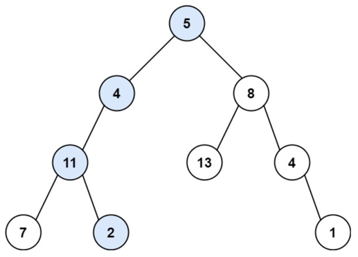

## Trees
I think it is more natural to have different section of documentation related to leetcode data structures
I will describe the basic idea or algorithms, probably with code snippets. 

#### Path sum
Given the root of a binary tree and an integer targetSum, return true if the tree has a root-to-leaf path such that adding 
up all the values along the path equals targetSum.  A leaf is a node with no children.

